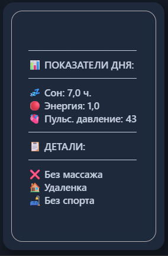

# Мониторинг здоровья и факторов влияния

## Цель проекта
Создать персональную аналитическую систему мониторинга состояния здоровья и образа жизни, которая позволит выявлять факторы, влияющие на уровень энергии, самочувствие и общее состояние.

  

---

## Задачи
- Собрать и структурировать данные о сне, давлении, пульсе, энергии, самочувствии и настроении.
- Построить интерактивный дашборд для ежедневного мониторинга.
- Выявить факторы, оказывающие положительное и отрицательное влияние на состояние.
- Научиться работать с полным циклом аналитического проекта: от подготовки данных до визуализации и выводов.

---

## Что было сделано
- Создана модель данных в Power BI.
- Выполнена очистка и трансформация данных в Power Query.
- Разработаны DAX-меры для расчёта KPI и аналитических показателей.
- Реализованы интерактивные карточки показателей.
- Построен календарь состояния с ежедневной детализацией.
- Выполнен анализ влияния сна, спорта, офиса, массажа и показателей давления на уровень энергии.
- Реализованы предупреждения о рисковых состояниях.
- Подготовлены аналитические выводы и рекомендации.

### Интерактивная подсказка (Tooltip)
При наведении на любой день календаря всплывает детальная карточка с показателями конкретного дня:

  
  

---

## Анализ динамики и факторов риска

### Изменение основных показателей и давления во времени:

  
  

### Выявление скрытых взаимосвязей и выводы:

  

---

## Результат
Получен полноценный аналитический инструмент для долгосрочного мониторинга здоровья.
Проект позволил выявить первые закономерности между образом жизни и уровнем энергии, а также стал практическим кейсом по Power BI, DAX, моделированию данных и аналитическому мнению.

---

## Используемые инструменты
Power BI | Power Query | DAX | Excel | Data Modeling | Data Visualization
