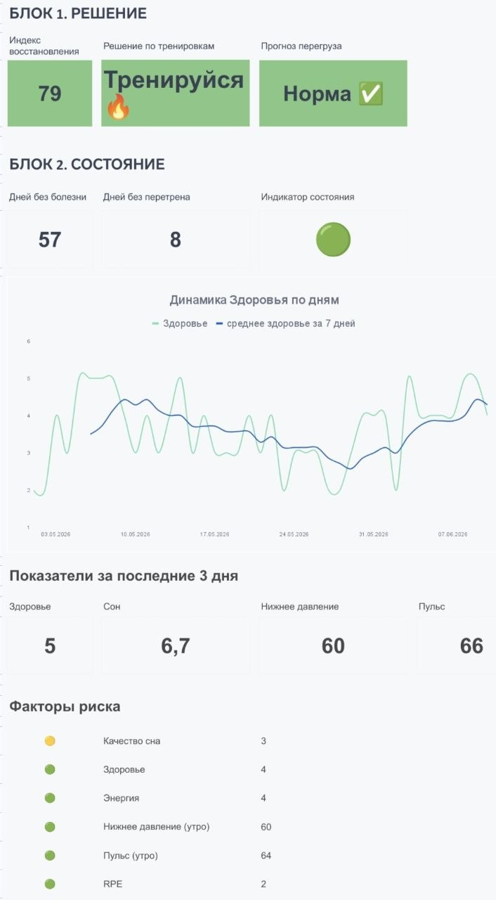
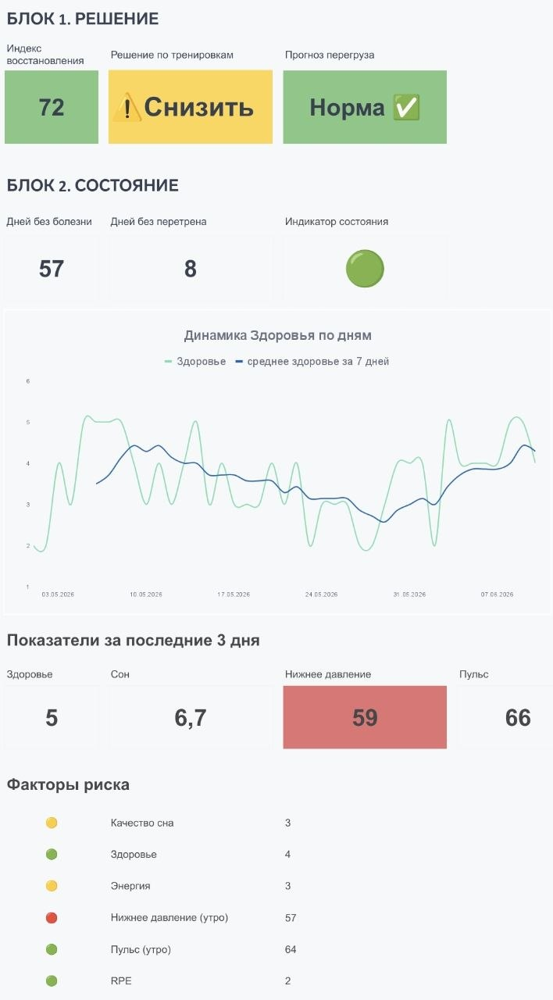
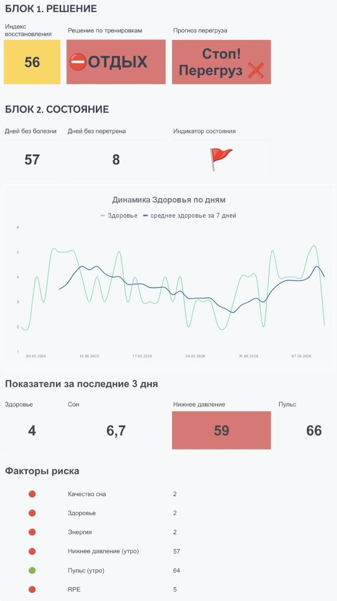

# Красная зона: система раннего предупреждения о риске перетренированности

## ℹ️ О проекте
«Красная зона» — персональная аналитическая система поддержки принятия решений для ежедневной оценки состояния здоровья и определения безопасного уровня нагрузки.

Проект появился как развитие моего основного дашборда в Power BI. Если тот инструмент помогал анализировать данные «задним числом» и искать долгосрочные закономерности, то «Красная зона» решает другую задачу — помогает принять решение здесь и сейчас.

Основная цель — снизить риск перетренированности, ухудшения самочувствия и развития заболеваний за счёт своевременного выявления тревожных сигналов.

  

---

## 📝 Бизнес-задача
В течение нескольких месяцев я заметила тревожную тенденцию:
- Частые простуды и герпес.
- Снижение энергии.
- Длительное восстановление после тренировок.

**Проблема:** субъективные ощущения не всегда отражают реальное состояние организма. Решение о тренировке часто принималось на основе эмоций («хочу» / «не хочу»), а не объективных данных.

Потребовался простой и быстрый инструмент, который:
- Работает на телефоне.
- Требует минимум времени на заполнение.
- Автоматически оценивает риск.
- Помогает принять решение за несколько секунд.

---

## 📊 Механика расчёта

### Индекс восстановления
Сердце системы — индекс восстановления, который рассчитывается по взвешенной формуле:

| Показатель | Вес |
| :--- | :--- |
| Сон | 30% |
| Здоровье | 30% |
| Энергия | 20% |
| Давление (нижнее) | 10% |
| Пульс (утренний) | 10% |

Индекс отражает общую готовность организма к нагрузке и динамически меняется в зависимости от ежедневных показателей.

**Логика расчёта:**
- KPI верхнего уровня рассчитываются как среднее за последние 3 дня (скользящее окно), чтобы отслеживать накопленную усталость.
- Вердикт по тренировкам выносится на основе правил, сформированных из наблюдений за собственными данными.

---

## ⚙️ Логика модели (три сценария)

### 🟢 Зелёная зона — тренировка разрешена
- **Индекс восстановления:** 79
- **Решение:** Тренируйся
- **Прогноз перегруза:** Норма ✅
- **Факторы риска:** Все факторы риска — зелёные
- **Условия:** Отсутствуют красные флага, сон > 6.5 часов, достаточный уровень энергии, все показатели в норме.

### 🟡 Жёлтая зона — снизить нагрузку
- **Индекс восстановления:** 72
- **Решение:** Снизить
- **Прогноз перегруза:** Норма ✅ *(риска нет, но организм уже не на пике)*
- **Условия:** Пульсовое давление, сон или энергия падают ниже индивидуальной нормы, присутствуют признаки усталости, общее состояние ухудшается.

  

### 🔴 Красная зона — стоп, отдых
- **Индекс восстановления:** 56
- **Решение:** ОТДЫХ
- **Прогноз перегруза:** Стоп! Перегруз
- **Условия (достаточно одного):**
  - **Накопленная усталость:** 2 дня подряд низкая энергия + RPE > 3.
  - Недостаток сна + плохое самочувствие.
  - Низкое давление + ухудшение состояния.
  - Тяжёлая нагрузка без восстановления.
  - Выраженная боль или признаки перегрузки.

  

---

## 🛠️ Реализация и интерфейс
Инструмент реализован в Google Sheets для максимальной мобильности. Вся логика работает на формулах и условном форматировании.

### Основные блоки интерфейса:

| Блок | Что показывает |
| :--- | :--- |
| **Индекс восстановления** | Число от 0 до 100, готовность к нагрузке |
| **Решение по тренировкам** | «Тренируйся» / «Снизить» / «Отдых» |
| **Прогноз перегруза** | «Норма» / «Стоп! Перегруз» |
| **Дней без болезни** | Длительность стабильного периода |
| **Дней без перетрена** | Счётчик восстановления |
| **Динамика здоровья** | Тренд за 7 дней (факт vs скользящее среднее) |
| **Показатели за 3 дня** | Здоровье, сон, давление, пульс |
| **Факторы риска** | Цветовой статус каждого показателя |

---

## 🏆 Результаты

| Метка | До | После |
| :--- | :--- | :--- |
| **Время принятия решения** | 5–10 минут (гадания) | 10 секунд (по данным) |
| **Эпизоды «перетренировалась и заболела»** | регулярно | снижение на 60% за 2 месяца |
| **Контроль состояния** | субъективный | объективный, по правилам |

**Главный итог:** система полностью заменила субъективные гадания на чёткие правила, основанные на данных.

---

## 🧠 Продемонстрированные навыки
- Анализ данных и поиск закономерностей.
- Формализация правил для автоматических расчётов.
- Построение систем поддержки принятия решений.
- Разработка KPI и индикаторов состояния.
- UX-проектирование (компактный интерфейс для телефона).
- Визуализация данных и условное форматирование.

---

## 🧰 Используемые инструменты
Google Sheets | Excel formulas | Data Visualization | UX Design | Decision Support Systems
