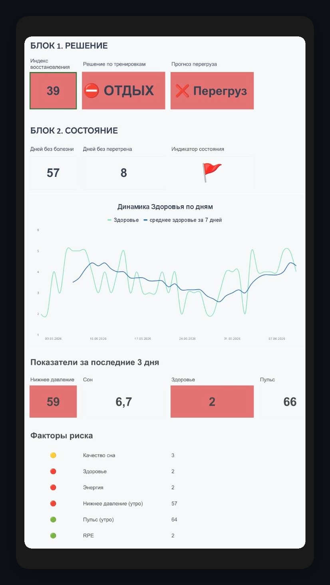
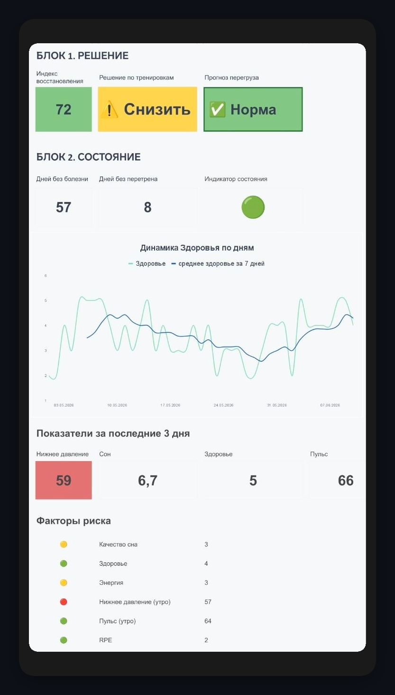

# Красная зона: система раннего предупреждения о риске перетренированности и ухудшения здоровья

## О проекте
«Красная зона» — персональная аналитическая система поддержки принятия решений, разработанная для ежедневной оценки состояния здоровья и определения безопасного уровня физической нагрузки.

Проект появился как развитие более крупного дашборда мониторинга здоровья, созданного в Power BI. 

Если основной дашборд помогал анализировать данные задним числом и искать закономерности, то «Красная зона» решает другую задачу — помогает принять решение здесь и сейчас.

Основная цель проекта — снизить риск перетренированности, ухудшения самочувствия и развития заболеваний за счёт своевременного выявления тревожных сигналов.

---

## Бизнес-задача
В течение нескольких месяцев наблюдалось увеличение количества эпизодов ухудшения самочувствия:
- Частые простудные заболевания.
- Герпес.
- Снижение энергии.
- Длительное восстановление после тренировок.

Проблема заключалась в том, что субъективные ощущения не всегда отражали реальное состояние организма. Решение о тренировке часто принималось на основе мотивации, а не объективных данных.

Возникла необходимость создать простой инструмент, который:
- Работает на телефоне.
- Требует минимального времени на заполнение.
- Автоматически оценивает риск.
- Помогает принять решение за несколько секунд.

---

## Используемые данные и механика расчета
Система анализирует ежедневные показатели:
- Продолжительность сна.
- Качество восстановления.
- Утренний пульс.
- Нижнее артериальное давление.
- Субъективную оценку здоровья по шкале 1–5.
- Уровень нагрузки по шкале RPE.
- Наличие признаков перегруза.

**Логика расчёта агрегатов:**
- **KPI-карточки верхнего уровня** автоматически рассчитывают среднее значение каждого показателя за последние 3 дня (скользящее окно), позволяя отслеживать накопленную усталость.
- **Блок «Вердикт»** рассчитывает результат по текущему состоянию на сегодняшний день.

---

## Логика модели
В основе решения лежит набор правил, сформированных на основе наблюдений за собственными данными.

### 🔴 Красный флаг (Вердикт: Нужен отдых / Стоп! Перегруз)
Система переводит пользователя в красную зону, если выполняется хотя бы одно из условий:
- **Накопленная усталость:** В течение 2 дней подряд фиксируется низкая энергия в сочетании с высокой тяжестью тренировок (уровень нагрузки RPE > 3) — система выдает критический сигнал «Стоп! Перегруз».
- Недостаток сна и плохое самочувствие.
- Низкое давление в сочетании с ухудшением состояния.
- Признаки плохого восстановления.
- Тяжёлая нагрузка без достаточного отдыха.
- Выраженная боль или признаки перегрузки организма.

### 🟡 Жёлтая зона (Вердикт: Снизить нагрузку)
Система рекомендует снизить интенсивность, если:
- **Скрытый спад:** Пульсовое давление, либо продолжительность сна, либо уровень энергии уходят в минус или падают ниже индивидуальной нормы.
- Присутствуют признаки перетренированности.
- Ухудшается общее состояние здоровья.

### 🟢 Зелёная зона (Вердикт: Тренировка разрешена)
Тренировка разрешена при выполнении следующих условий:
- Отсутствуют красные флаги и признаки перегруза.
- Средняя продолжительность сна превышает 6,5 часов.
- Субъективно ощущается достаточный уровень энергии.

---

## Реализация и интерфейс
Инструмент был реализован в Google Sheets для максимальной мобильности. В зависимости от входящих данных система динамически меняет интерфейс.

### Вариант 1: Сигнал «Стоп! Перегруз» при высоком риске

  

### Вариант 2: Предупреждение «Снизить нагрузку» при фиксации просадок

  

Основные элементы интерфейса:
- **Индикатор состояния:** Визуальный цветовой статус (зелёный, жёлтый, красный).
- **Прогноз перегруза:** Дополнительный блок, предупреждающий о рисках до появления выраженных симптомов.
- **Счётчик дней без перетренированности:** Показывает количество дней стабильного восстановления для планирования нагрузок.
- **График динамики здоровья:** Позволяет отслеживать долгосрочный тренд состояния.

---

## Полученные результаты
После внедрения системы ежедневные решения стали приниматься на основе данных, а не интуиции.

Проект позволил:
- Стандартизировать оценку состояния здоровья.
- Выявлять риски раньше появления болезни.
- Снизить количество ошибочных тренировочных решений.
- Использовать аналитику как инструмент профилактики.

---

## Продемонстрированные навыки
- Анализ данных и поиск закономерностей.
- Описание правил логики для автоматических расчётов.
- Построение систем поддержки принятия решений.
- Разработка KPI и индикаторов состояния.
- Визуализация данных и проработка удобства интерфейса (UX).

---

## Используемые инструменты
Google Sheets | Excel formulas | Data Visualization | UX Design | Decision Support Systems
