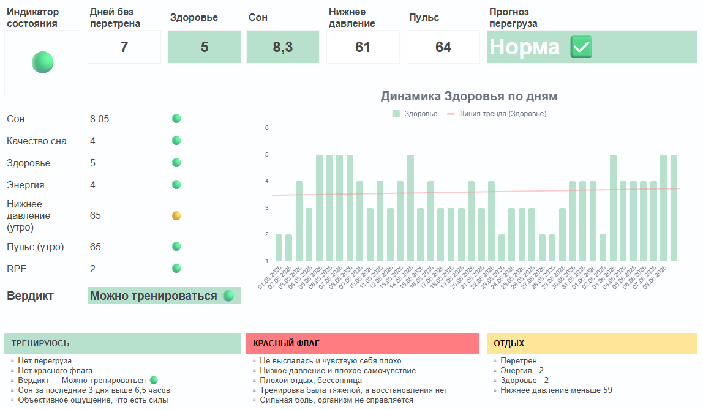

# Красная зона: система раннего предупреждения о риске перетренированности и ухудшения здоровья

## О проекте
«Красная зона» — персональная аналитическая система поддержки принятия решений, разработанная для ежедневной оценки состояния здоровья и определения безопасного уровня физической нагрузки.

Проект появился как развитие более крупного дашборда мониторинга здоровья, созданного в Power BI. Если основной дашборд помогал анализировать данные задним числом и искать закономерности, то «Красная зона» решает другую задачу — помогает принять решение здесь и сейчас.

Основная цель проекта — снизить риск перетренированности, ухудшения самочувствия и развития заболеваний за счёт своевременного выявления тревожных сигналов.

  

---

## Бизнес-задача
В течение нескольких месяцев наблюдалось увеличение количества эпизодов ухудшения самочувствия:
- Частые простудные заболевания.
- Герпес.
- Снижение энергии.
- Длительное восстановление после тренировок.

Проблема заключалась в том, что субъективные ощущения не всегда отражали реальное состояние организма. Решение о тренировке часто принималось на основе мотивации, а не объективных данных.

Возникла необходимость создать простой инструмент, который:
- Работает на телефоне.
- Требует минимального времени на заполнение.
- Автоматически оценивает риск.
- Помогает принять решение за несколько секунд.

---

## Используемые данные
Система анализирует ежедневные показатели:
- Продолжительность сна.
- Качество восстановления.
- Утренний пульс.
- Нижнее артериальное давление.
- Субъективную оценку здоровья по шкале 1–5.
- Уровень нагрузки по шкале RPE.
- Наличие признаков перегруза.

Для принятия решения используются как текущие показатели, так и данные за последние несколько дней.

---

## Логика модели
В основе решения лежит набор правил, сформированных на основе наблюдений за собственными данными.

### 🔴 Красный флаг
Система переводит пользователя в красную зону, если выполняется хотя бы одно из условий:
- Недостаток сна и плохое самочувствие.
- Низкое давление в сочетании с ухудшением состояния.
- Признаки плохого восстановления.
- Тяжёлая нагрузка без достаточного отдыха.
- Выраженная боль или признаки перегрузки организма.

### 🟡 Жёлтая зона
Система рекомендует снизить нагрузку, если:
- Присутствуют признаки перетренированности.
- Уровень энергии снижается до критических значений.
- Ухудшается общее состояние здоровья.

### 🟢 Зелёная зона
Тренировка разрешена при выполнении следующих условий:
- Отсутствуют красные флаги.
- Отсутствуют признаки перегруза.
- Средняя продолжительность сна превышает 6,5 часов.
- Субъективно ощущается достаточный уровень энергии.

---

## Реализация
Инструмент был реализован в Google Sheets для максимальной мобильности.

Основные элементы интерфейса:
- **Индикатор состояния:** Цветовой статус (зелёный — можно тренироваться; жёлтый — снизить нагрузку; красный — нужен отдых).
- **Прогноз перегруза:** Дополнительный блок, который предупреждает о риске перегрузки ещё до появления выраженных симптомов.
- **Счётчик дней без перетренированности:** Показывает количество дней стабильного восстановления и помогает планировать увеличение нагрузки.
- **График динамики здоровья:** Позволяет отслеживать долгосрочный тренд состояния и оценивать эффективность восстановления.

---

## Полученные результаты
После внедрения системы ежедневные решения стали приниматься на основе данных, а не интуиции.

Проект позволила:
- Стандартизировать оценку состояния здоровья.
- Выявлять риски раньше появления болезни.
- Снизить количество ошибочных тренировочных решений.
- Использовать аналитику как инструмент профилактики, а не только анализа прошлого.

---

## Продемонстрированные навыки
- Анализ данных и поиск закономерностей.
- Формализация бизнес-логики в виде правил.
- Построение системы поддержки принятия решений (СППР).
- Разработка KPI и индикаторов состояния.
- Визуализация данных.
- Работа с пользовательским опытом (UX).
- Проектирование аналитических продуктов для ежедневного использования.

---

## Главный вывод
Ценность аналитики заключается не только в построении красивых дашбордов. Намного важнее способность превращать данные в конкретные действия.

Проект «Красная зона» показывает, как простая система правил и визуальных сигналов может влиять на поведение пользователя и помогать принимать более безопасные и обоснованные решения.

---

## Используемые инструменты
Google Sheets | Excel formulas | Data Visualization | UX Design | Decision Support Systems
